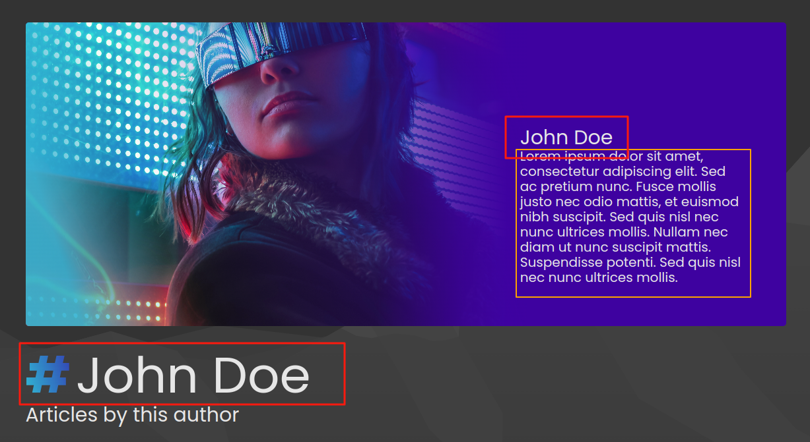
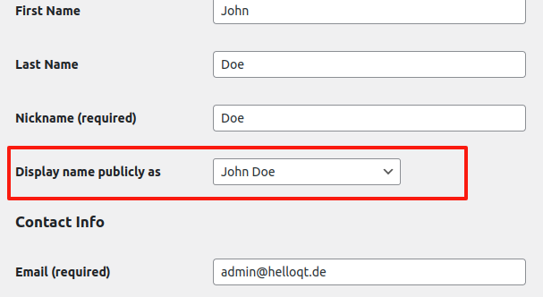
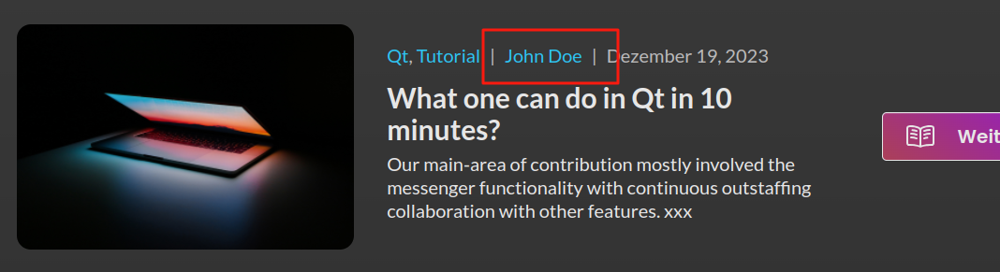
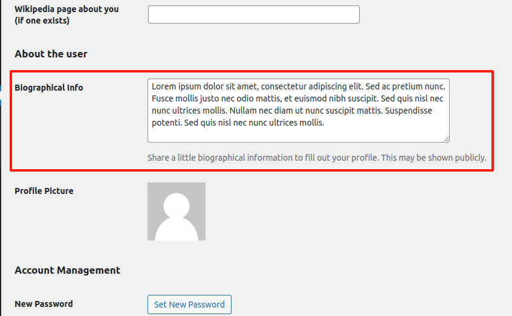
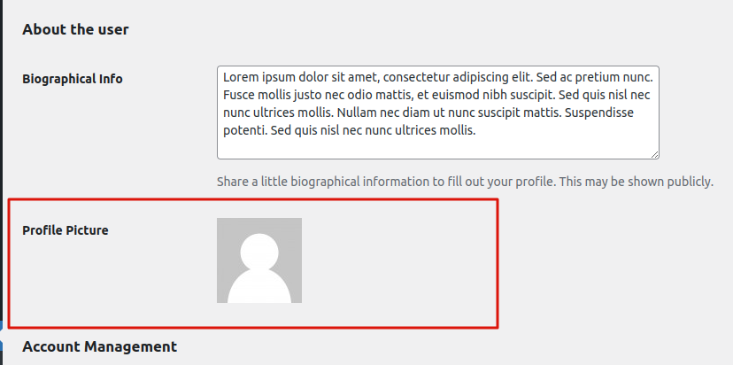
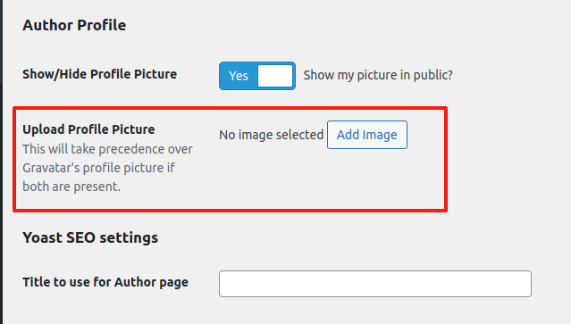
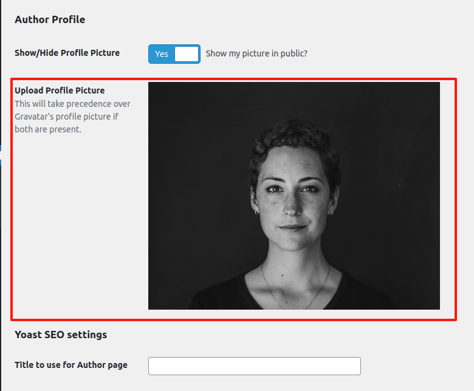
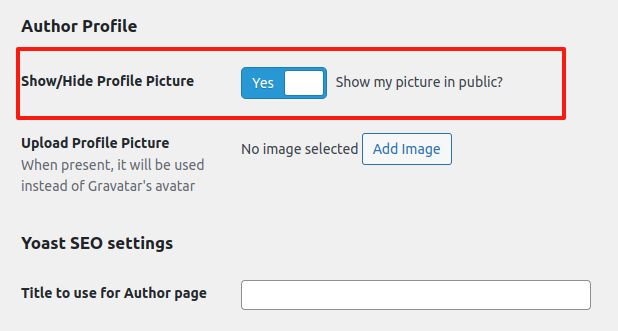

# Author Profiles

[Author archive](https://www.helloqt.de/author/admin) pages display the author's
name, biography and profile picture as shown below.

## Author Information

This information can be managed from the author's [admin profile](https://www.helloqt.de/wp-admin/profile.php) page.

### Display Name

The value of the **`Display name publicly as`** field will be used as the author's name. Ensure the appropirate one is selected.

This is the name used to publicly identify the author everywhere on the site including comments and post metadata.

### Biography

The **`Biographical Info`** field holds the author's bio.

### Profile Picture

#### Gravatar Profile

By default, if an author has a https://gravatar.com/ account (identified by their email address),
the account profile picture will be used.

The gravatar profile picture is displayed on the **`Profile Picture`** field if present.

#### Upload A Photo

If an author has no [Gravatar](https://gravatar.com/) account or would like to use a different profile picture,
they can upload one. This can be done from the **`Upload Profile Picture`** field.

An uploaded profile picture will take precedence over Gravatar's profile picture if both are present.

#### Hide/Show Photo

It is posible for any user (authors inclued) to become faceless. That is, users can choose
whether to show/hide their profile pictures on the site.
This can be done by toggling the **`Show/Hide Profile Picture`** field.
When turned off `no`, the user's profile picture will not be shown anywhere
on the site. Even if one is present through the above mechanisms.

