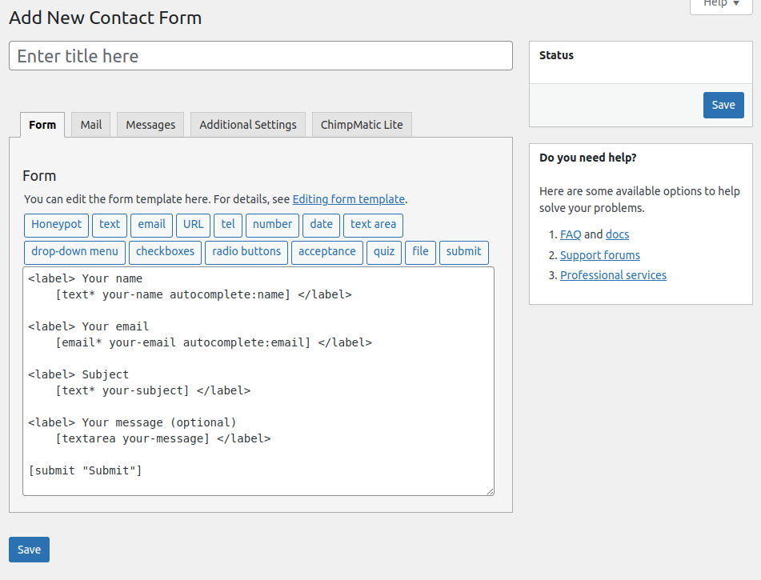
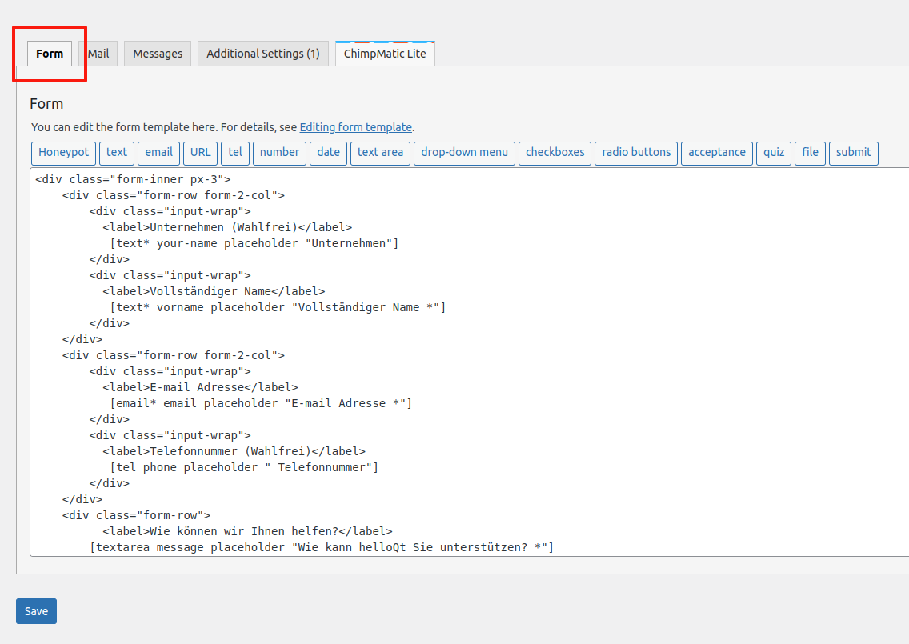
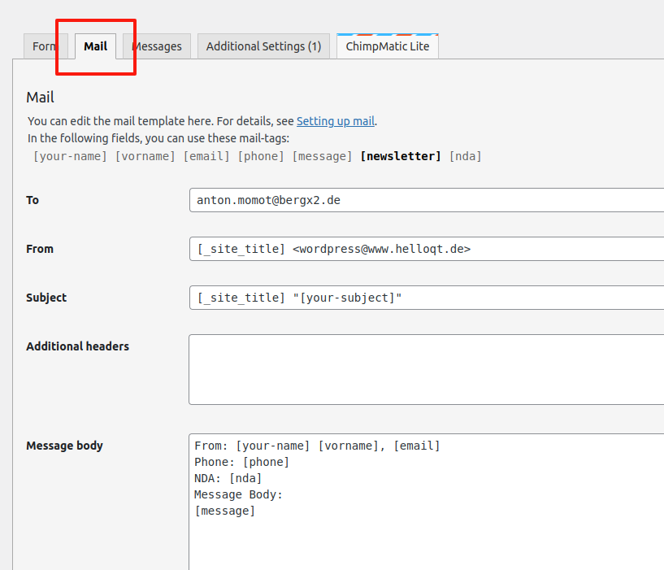
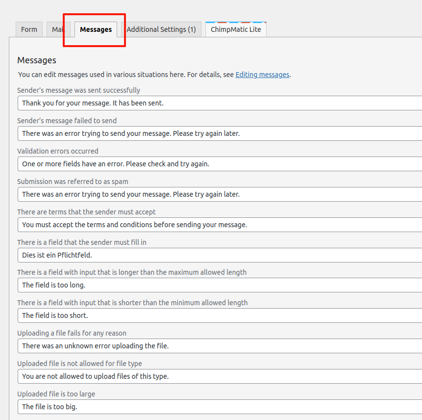
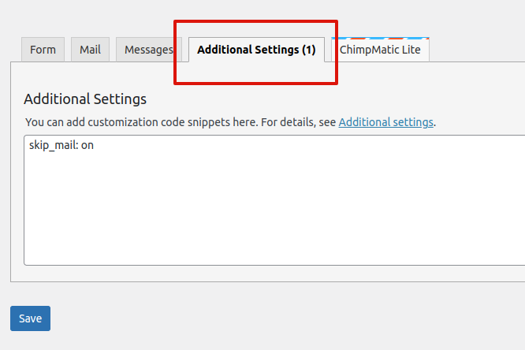
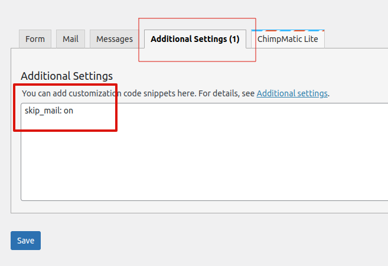
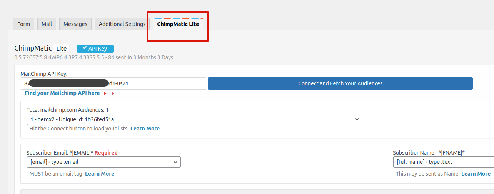

# Contact Forms

The [Contact Form 7 (CF7)](/docs/glossary#cf7) plugin together with it's
[ChimpMatic](/docs/glossary#chimpmatic) extension are used to provide all
the contact and newsletter form functionality.

[CF7](/docs/glossary#cf7) enables us to easily create forms and display them anywhere on the site. And
when a form is submitted, the plugin also takes care of all the processing from input validation to
storage of the submitted data. CF7 forms are automatically styled by the theme ensuring they conform to
the site's design out of the box.

Forms can be created and/or edited from the
[contact forms](https://www.helloqt.de/wp-admin/admin.php?page=wpcf7) admin section.
We'll briefly discuss how to do this in the sections that follow.

To learn more, please consult CF7's [official documentation](https://contactform7.com/docs).

## The Form Editor

[CF7](/docs/glossary#cf7) provides a [contact form editor](https://contactform7.com/admin-screen/) screen
which is loaded when you [add a new](https://www.helloqt.de/wp-admin/admin.php?page=wpcf7-new) form
or [edit an existing](https://www.helloqt.de/wp-admin/admin.php?page=wpcf7) one.

This screen consists of several panels/tabs used to manage various aspects of the form.

From here, we are able manage the following: -

### 1. Form Template

A form template defines a form's **input fields** and how they should be **displayed** to users.

It can be edited from the `Form` panel.

Editing form templates is a fairly easy task for any experienced WordPress administrator.  
But, a little bit of coding skills might be required especially when creating highly customized forms.

##### See Also

-   [Documentation — Editing form templates](https://contactform7.com/editing-form-template/)

### 2. Mail Template

Whenever a user fills-in and submits a contact form, [CF7](/docs/glossary#cf7) can send the submitted
information via email to a configured email address.  
The recipient and contents of this email makeup the _Mail Template_.

They can configured from the `Mail` panel of the form.

In some cases like in our newsletter form, this feature might not be needed.
It can be disable using the `skip_mail` setting as we'll see [later](#additional-settings).

##### See Also

-   [Documentation — Setting up mail](https://contactform7.com/setting-up-mail/)

### 3. Feedback Messages

Whenever a user fills-in and submits a contact form, one or more of several feedback messages
will be shown based on the submission outcome.

Each outcome, good or bad, has a corresponding feedback message that is displayed whenever that outcome is reached.

These messages can be edited from the `Messages` panel of the form.

:::tip[Internationalization]

Make sure all messages have corresponding translations to all supported languages

:::

### 4. Additional Settings

[CF7](/docs/glossary#cf7) and it's extensions support a couple of settings which can be added to
a form to change and/or extend it's behaviour.

These settings can be configured from the `Additional Settings` panel.

For example, we can prevent CF7 from sending us [emails](#mail-template) by setting the `skip_mail`
setting to `on`.

##### See Also

-   [Documentation — Additional settings](https://contactform7.com/additional-settings/)

### 5. MailChimp Subscription

The [ChimpMatic](/docs/glossary#chimpmatic) extension allows us to subscribe users to
[MailChimp](/docs/glossary#mailchimp) mailing lists upon form submission.
[ChimpMatic](/docs/glossary#chimpmatic) does this by sending provided contact
information to MailChimp upon form submission.
Depending on the situation, this could happen implicitly or upon an explicit concent from the user.

For example, our newsletter form sends this information implicitly. On the other hand,
users have to explicitly `opt-in` by `checking` the newsletter checkbox on main contact form
for them to be added to a mailing list.

All this can be managed from the `ChimpMatic Lite` panel on the form editor.

##### See Also

-   [Documentation — ChimpMatic](https://chimpmatic.com/help)

## Displaying Forms

Contact forms can be placed in any editable part of the site. This can be done using either the
`Contact Form 7` _block_ or the `[contact-form-7]` _shortcode_ provided by [CF7](/docs/glossary#cf7).

### Using The Block (Recommended)

A `Contact Form 7` _block_ can be inserted into content through the block editor. Since `HelloQt`
is a block theme, it means that the block can be inserted literally anywhere.

It can be inserted it into: -

-   Individual posts and/or pages as part of the content. E.g. The contact form in home page.
-   Templates where it can be shared across multiple posts/pages
-   Template parts where it can be shared across multiple templates.

### Using The Shortcode

Alternatively, the `[contact-form-7]` _shortcode_ can be used to add a contact form to the site.
It can be used anywhere where `[shortcodes]` are supported. Like the block, it can be added through
the block editor using the `shortcode` WordPress block.

Through the `shortcode` block, the `[contact-form-7]` shortcode can also be inserted in all the locations
above where the `Contact Form 7` _block_ is available.

## Default Forms

HelloQt's design includes two default forms.

These are: -

1. The main contact form
2. Newsletter subscription form

These forms were created during initial site setup and are configured to conform with each of their
design specifications.

:::warning

The design specification only covers the layout and appearance of the forms.

It is the responsibility of content administrator(s) to define the content used within the forms.  
This includes: -

-   Input labels
-   Feedback messages
-   Email contents

:::

### The Contact Form

This is the main contact form currently located on the home page.

The following form contents need to be updated according

-   The input labels
-   Email contents
-   Feedback messages

### The Newsletter Form

The main contact form
